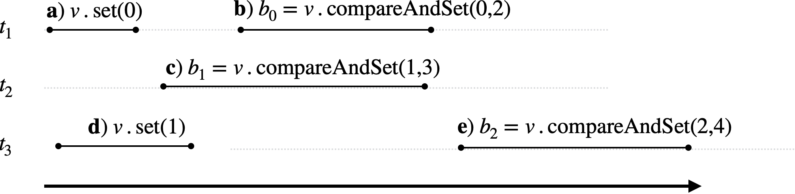
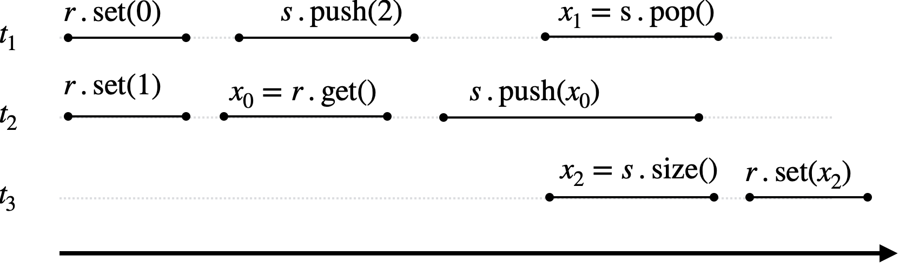

# Ficha de Exercícios 5


__[Programação Concorrente (CC3037)](https://www.dcc.fc.up.pt/~edrdo/aulas/pc), DCC/FCUP__

_Eduardo R. B. Marques, DCC/FCUP_


## 1

Considere a história de ações concorrentes ilustrada pela figura abaixo, envolvendo 3 threads, um registo $r$ e uma stack~$s$. 
Assuma que a operação `pop()` devolve `null` para uma stack vazia.

   
 
a. Identifique as precedências entre operações na história apresentada. 

b. Apresente uma linearização possível para a história que seja coerente com cada uma das seguintes condições no final da execução:
 
  - Fica o valor 0 na stack.
  - Fica o valor 1 na stack.
  - Fica o valor 2 na stack.
  - $x_0 = x_1$.
  - $x_0 \neq x_1$.
  - $x_2 = s.{\rm size}()$.
  - $x_2 \neq s.{\rm size}()$.
   
b. Identifique exaustivamente as linearizações possíveis da história apresentadada e os valores $x_0$ a $x_2$ obtidos bem como o estado da stack $s$ no final para cada uma das linearizações. 

c. Em `src/pc/Ex1Test.java` é fornecido um programa Java que executa uma história análoga à apresentada usando o Cooperari. Introduza código no final que complete a asserção de valores possíveis para $x_0$ a $x_2$.

Para compilar e executar o programa execute os seguintes comandos a partir do directório 
de topo:

  ```
# Para compilar / recompilar
cjavac

# Para executar
cjava pc.Ex1Test
  ```


## 2
 
Considere a história de ações concorrentes ilustrada pela figura abaixo, envolvendo 3 threads e um objecto $v$ do tipo `AtomicInteger`.



a. Identifique as precedências entre operações na história apresentada. 

b. Identifique as linearizações possíveis da história e o valores $b_0$ a $b_3$ e $v$ obtidos para cada uma das linearizações. 

c. Identifique uma história linear que seja consistente sequencialmente com a história apresentada e que leva a que seja
guardado o valor $0$ para $v$ no final.

d. Em `src/pc/Ex2Test.java` é fornecido um programa Java incompleto a executar com o Cooperari. Pretende-se que execute uma história análoga à apresentada. Introduza código para que tal aconteça usando `CSystem.forkAndJoin()` e asserções no final do programa para validar as combinações de valores possíveis para $b_0$ a $b_3$. 


